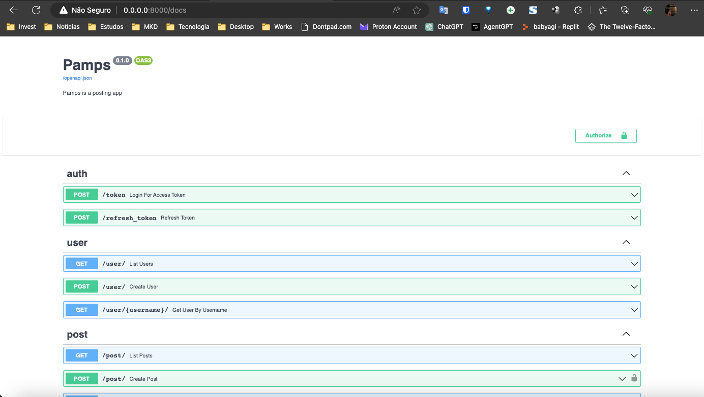
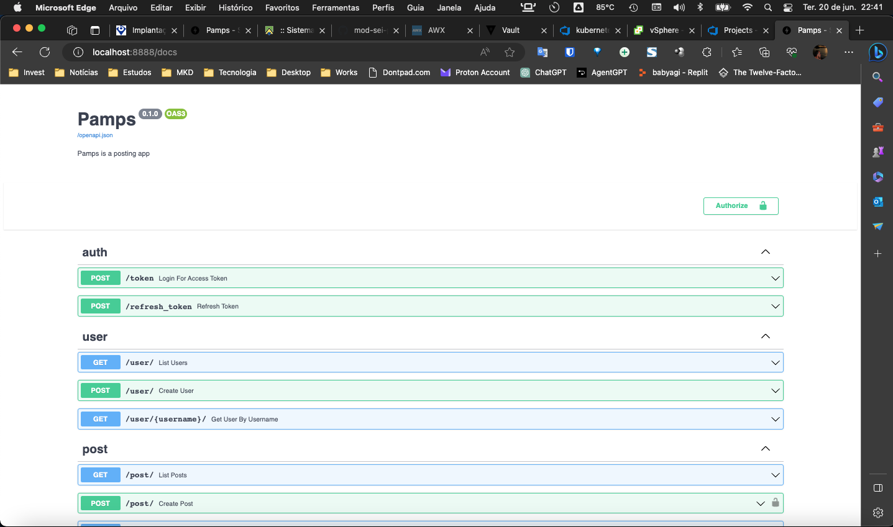

# project_fastapi_example


### Projeto construído a partir do workshop da linuxtips de fastapi.

### Fiz vários commits com comentários para possibilitar o acompanhamento do desenvolvimento em cada estado que o projeto passou.

### Ao final, temos uma aplicação funcional onde testes foram configurados utilizando um pipeline shell para executar todos os passos de todos os processos mapeados no sistema.

Executando o projeto:
- Via docker-compose
```
*[main][~/Workspace/Tecnologias/Python/fastapi-lab]$ docker-compose up
[+] Building 959.0s (15/15) FINISHED
 => [internal] load build definition from Dockerfile.dev                                                                                                                     0.2s
 => => transferring dockerfile: 386B                                                                                                                                         0.2s
 => [internal] load .dockerignore                                                                                                                                            0.1s
 => => transferring context: 2B                                                                                                                                              0.1s
 => [internal] load metadata for docker.io/library/python:3.10                                                                                                               3.4s
 => [auth] library/python:pull token for registry-1.docker.io                                                                                                                0.0s
 => [1/9] FROM docker.io/library/python:3.10@sha256:a8462db480ec3a74499a297b1f8e074944283407b7a417f22f20d8e2e1619782                                                         0.0s
 => [internal] load build context                                                                                                                                          782.5s
 => => transferring context: 150.82MB                                                                                                                                      782.3s
 => CACHED [2/9] RUN mkdir -p /home/app                                                                                                                                      0.0s
 => CACHED [3/9] RUN groupadd app && useradd -g app app                                                                                                                      0.0s
 => CACHED [4/9] RUN mkdir -p /home/app/api                                                                                                                                  0.0s
 => CACHED [5/9] WORKDIR /home/app/api                                                                                                                                       0.0s
 => [6/9] COPY . /home/app/api                                                                                                                                              11.8s
 => [7/9] RUN pip install -r requirements-dev.txt                                                                                                                           35.5s
 => [8/9] RUN pip install -e .                                                                                                                                              42.7s
 => [9/9] RUN chown -R app:app /home/app/api                                                                                                                                65.4s
 => exporting to image                                                                                                                                                      17.2s
 => => exporting layers                                                                                                                                                     17.1s
 => => writing image sha256:8625c0fb344fb4a89939019798af3dc8894ea610567165fb62a20d79d990b444                                                                                 0.0s
 => => naming to docker.io/library/fastapi-lab-api                                                                                                                           0.0s
[+] Running 2/2
 ⠿ Container fastapi-lab-db-1   Created                                                                                                                                      0.0s
 ⠿ Container fastapi-lab-api-1  Recreated                                                                                                                                    0.3s
Attaching to fastapi-lab-api-1, fastapi-lab-db-1
fastapi-lab-db-1   |
fastapi-lab-db-1   | PostgreSQL Database directory appears to contain a database; Skipping initialization
fastapi-lab-db-1   |
fastapi-lab-db-1   | 2023-06-20 19:04:56.401 UTC [1] LOG:  starting PostgreSQL 15.3 on x86_64-pc-linux-musl, compiled by gcc (Alpine 12.2.1_git20220924-r10) 12.2.1 20220924, 64-bit
fastapi-lab-db-1   | 2023-06-20 19:04:56.403 UTC [1] LOG:  listening on IPv4 address "0.0.0.0", port 5432
fastapi-lab-db-1   | 2023-06-20 19:04:56.409 UTC [1] LOG:  listening on IPv6 address "::", port 5432
fastapi-lab-db-1   | 2023-06-20 19:04:56.430 UTC [1] LOG:  listening on Unix socket "/var/run/postgresql/.s.PGSQL.5432"
fastapi-lab-db-1   | 2023-06-20 19:04:56.453 UTC [23] LOG:  database system was shut down at 2023-06-20 18:09:27 UTC
fastapi-lab-db-1   | 2023-06-20 19:04:56.477 UTC [1] LOG:  database system is ready to accept connections
fastapi-lab-api-1  | INFO:     Will watch for changes in these directories: ['/home/app/api']
fastapi-lab-api-1  | INFO:     Uvicorn running on http://0.0.0.0:8000 (Press CTRL+C to quit)
fastapi-lab-api-1  | INFO:     Started reloader process [1] using StatReload
fastapi-lab-api-1  | INFO:     Started server process [9]
fastapi-lab-api-1  | INFO:     Waiting for application startup.
fastapi-lab-api-1  | INFO:     Application startup complete.
fastapi-lab-db-1   | 2023-06-20 19:09:56.534 UTC [21] LOG:  checkpoint starting: time
fastapi-lab-db-1   | 2023-06-20 19:09:56.575 UTC [21] LOG:  checkpoint complete: wrote 3 buffers (0.0%); 0 WAL file(s) added, 0 removed, 0 recycled; write=0.007 s, sync=0.005 s, total=0.043 s; sync files=2, longest=0.003 s, average=0.003 s; distance=0 kB, estimate=0 kB
```

Para acessar o Swagger UI utilizar http://0.0.0.0:800/docs



#### CONHECENDO O APP ATRAVES DOS TESTES:


Na raiz do projeto execute:
```
*[main][~/Workspace/Tecnologias/Python/fastapi-lab]$ ./test.sh
[+] Running 2/2
 ⠿ Container fastapi-lab-db-1   Started                                                                                                                                      0.5s
 ⠿ Container fastapi-lab-api-1  Started                                                                                                                                      1.0s
INFO  [alembic.runtime.migration] Context impl PostgresqlImpl.
INFO  [alembic.runtime.migration] Will assume transactional DDL.
INFO  [alembic.runtime.migration] Running stamp_revision 57e14d12e6b7 ->
INFO  [alembic.runtime.migration] Context impl PostgresqlImpl.
INFO  [alembic.runtime.migration] Will assume transactional DDL.
INFO  [alembic.runtime.migration] Running upgrade  -> c991cadf33c1, initial
INFO  [alembic.runtime.migration] Running upgrade c991cadf33c1 -> 57e14d12e6b7, post
============================================================================== test session starts ===============================================================================
platform linux -- Python 3.10.12, pytest-7.3.1, pluggy-1.0.0 -- /usr/local/bin/python
cachedir: .pytest_cache
rootdir: /home/app/api
plugins: anyio-3.7.0, order-1.1.0
collected 6 items

tests/test_api.py::test_post_create_user1 PASSED                                                                                                                           [ 16%]
tests/test_api.py::test_reply_on_post_1 PASSED                                                                                                                             [ 33%]
tests/test_api.py::test_post_list_without_replies PASSED                                                                                                                   [ 50%]
tests/test_api.py::test_post1_detail PASSED                                                                                                                                [ 66%]
tests/test_api.py::test_all_posts_from_user1 PASSED                                                                                                                        [ 83%]
tests/test_api.py::test_all_posts_from_user1_with_replies PASSED                                                                                                           [100%]

=============================================================================== 6 passed in 3.28s ================================================================================
[+] Running 3/3
 ⠿ Container fastapi-lab-api-1  Removed                                                                                                                                     10.3s
 ⠿ Container fastapi-lab-db-1   Removed                                                                                                                                      0.3s
 ⠿ Network fastapi-lab_default  Removed                                                                                                                                      0.1s
*[main][~/Workspace/Tecnologias/Python/fastapi-lab]$
```


#### Validação

- utilizar port-forward para validação de fora do cluster k8s
```
*[main][~/Workspace/Tecnologias/Python/fastapi-lab/k8s]$ k port-forward svc/api 8888:8000
Forwarding from 127.0.0.1:8888 -> 8000
Forwarding from [::1]:8888 -> 8000
Handling connection for 8888
Handling connection for 8888
```


